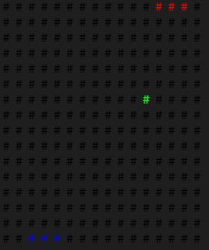
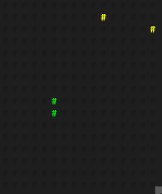
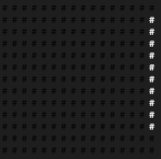

# LED Jumper

# Components
* Raspberry Pi Zero 2 W [link](https://www.amazon.co.uk/Raspberry-Pi-Zero-2-W/dp/B09KLVX4RT/ref=sr_1_3?crid=2XYQPTYX1BDMS&keywords=raspberry+pi+zero&qid=1647071654&sprefix=raspberry+pi+zero%2Caps%2C75&sr=8-3)
* Flexible LED display [link](https://www.amazon.co.uk/gp/product/B088K1JH6X/ref=ppx_yo_dt_b_search_asin_title?ie=UTF8&psc=1)
* Power bank [link](https://www.amazon.co.uk/Anker-PowerCore-Ultra-Compact-Fast-Charging-Technology/dp/B01CU1EC6Y/ref=sr_1_4?crid=KR8XR198XW8O&keywords=lipstick+power+battery&qid=1647071730&sprefix=lipstick+power+batter%2Caps%2C64&sr=8-4)
* Micro SD card [link](https://www.amazon.co.uk/SanDisk-microSDHC-Adapter-Performance-SDSQUA4-032G-GN6MA/dp/B08GY9NYRM/ref=sr_1_5?crid=2ON0E4XSYL8JK&keywords=microsd&qid=1647071749&sprefix=microsd%2Caps%2C76&sr=8-5)
* USB cable [link](https://www.amazon.co.uk/LILMACC-Micro-Speed-Charger-Cable/dp/B09TPXQYGT/ref=sr_1_3?crid=XNFXV36Y60GY&keywords=usb+micro+cable+60cm&qid=1647071791&sprefix=usb+micro+cable+60cm%2Caps%2C63&sr=8-3)
